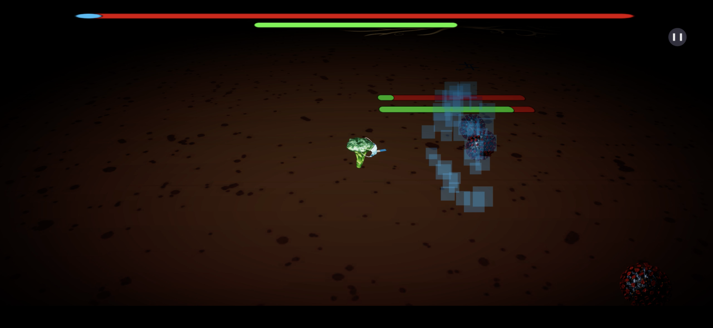
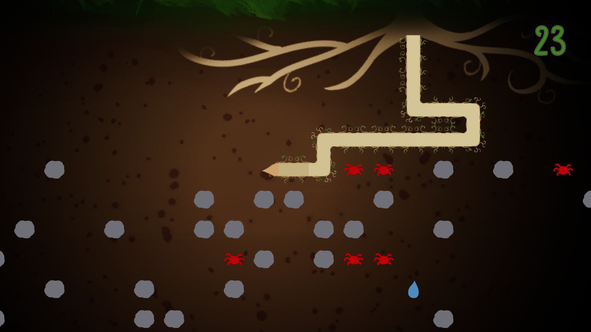
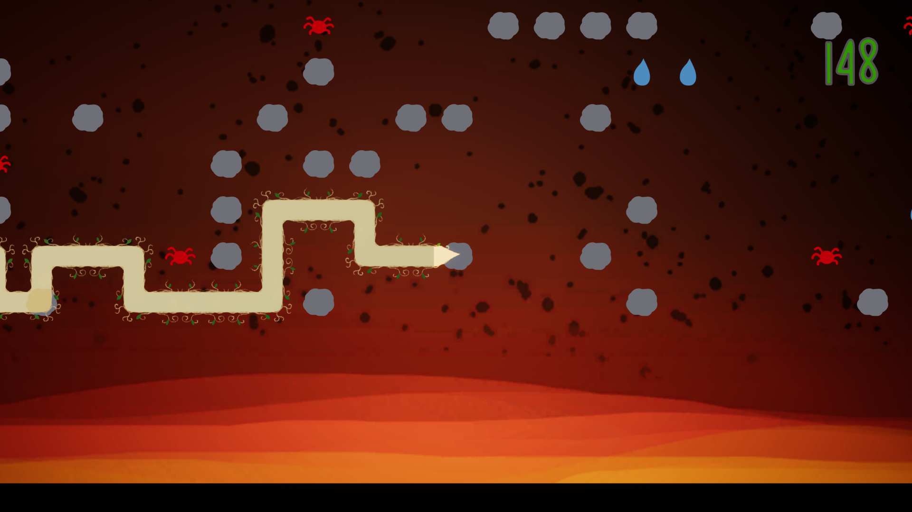

# BROcoli
You are a brocoli with a coronamask, try your best not to get infected.



The game can be played in the browser here:

https://budgetgamedev.github.io/BROcoli/


<br>

## Gameplay
- W A S D or arrow keys and enter for keyboard movement
- Left thumb stick and A on controller
- Virtual controller for mobile

<br>

## Images
<!--  -->
<!--  -->

## Development tooling

Install [Nix](https://nixos.org/download/), then enter the pinned development
environment from the repository root:

```bash
nix develop
```

This provides FFmpeg, ImageMagick, Fontconfig, and Python with Pillow for the
autoplay and E2E tooling. Install Unity 6.5 separately, using the exact editor
version pinned in [ProjectSettings/ProjectVersion.txt](ProjectSettings/ProjectVersion.txt).

## Disclaimer
This project is built partially using generative ai, with human in the loop, software engineering best practices and reviews by professional human software engineers.

## License
Elastic License 2.0 (see [LICENSE](./LICENSE))

By contributing, you agree to our [Contributor License Agreement](./CLA.md).
